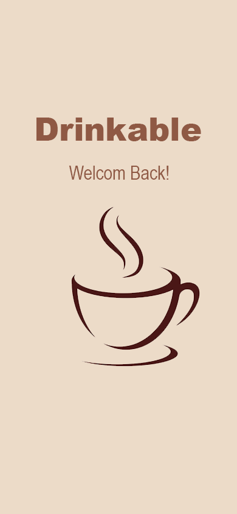
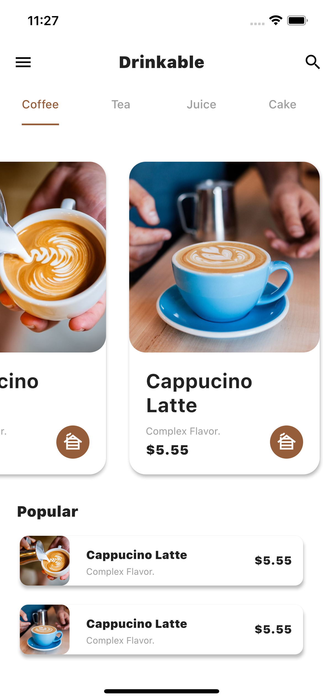
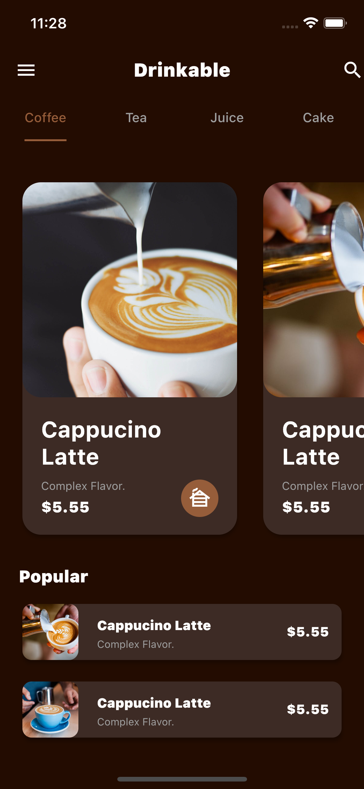
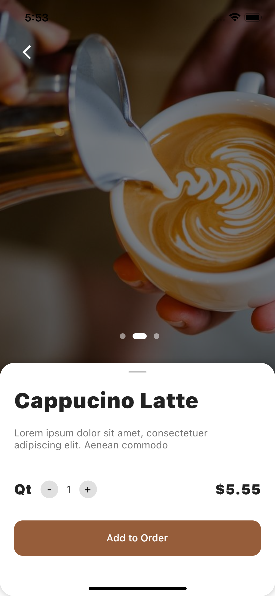
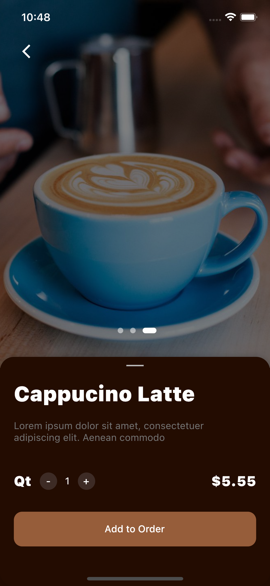

# Flutter coffee_app UI Speed Code With Getx Part #02

A new Flutter Speed Code UI Project on my Youtube Channel .

## About The Project

Create a beautiful Flutter UI Coffe App With Getx State Management & Get CLI

## Part 2

Create Details Page

> Links : for the tutrials Videos

- [Part#01 tutrial](https://youtu.be/RU5f6YPBvv8)
- [Part#02 tutrial](https://www.youtube.com/watch?v=Xx87CvOqd3U)
- [My youtube Channel](https://www.youtube.com/channel/UCnUh8WaDvVs1b0CbOv7UaWQ)

## Plugins

Coffee App is currently extended with the following plugins.
Instructions on how to use them in your own application are linked below.

| Plugin        | Link                                                   |
| ------------- | ------------------------------------------------------ |
| GetX          | https://pub.dev/packages/get                   |
| Get CLI       | https://pub.dev/packages/get_cli               |
| Sliding Panel | https://pub.dev/packages/sliding_up_panel      |
| Native Splash | https://pub.dev/packages/flutter_native_splash |

#Screen Shots

 

| Screen Shot                              | Screen Shot                              |
| ---------------------------------------- | ---------------------------------------- |
|  |  |
| Screen Shot                              | Screen Shot                              |
|  |  |
| Screen Shot                              | 
|          |
